# coucou-shell

A Fedora + [Hyprland](https://hyprland.org/) desktop, installed and kept up to date by its own manager. Besides the configuration of existing tools, it ships three native Rust/GTK4 apps: **[Roue](config/hyprland/roue-src)** (a radial selection wheel), **[Prisme](config/hyprland/prisme-src)** (a wallpaper picker) and **[Balise](config/hyprland/balise-src)** (a WiFi/Bluetooth/Ethernet daemon behind a panel in the bar).


## Quick start

On Fedora 44 (a netinstall is enough):

```bash
sudo dnf config-manager addrepo --from-repofile=https://lucasssoh.github.io/dotfiles/coucou-shell.repo
sudo dnf install cc-pkg-mng
cc-pkg-mng init
```

Then, to stay up to date:

```bash
cc-pkg-mng upgrade    # move to the latest release and apply it
cc-pkg-mng status     # check that everything is in place
```

The documentation is also online: https://lucasssoh.github.io/dotfiles/

## Screenshots

| | |
|:---:|:---:|
| [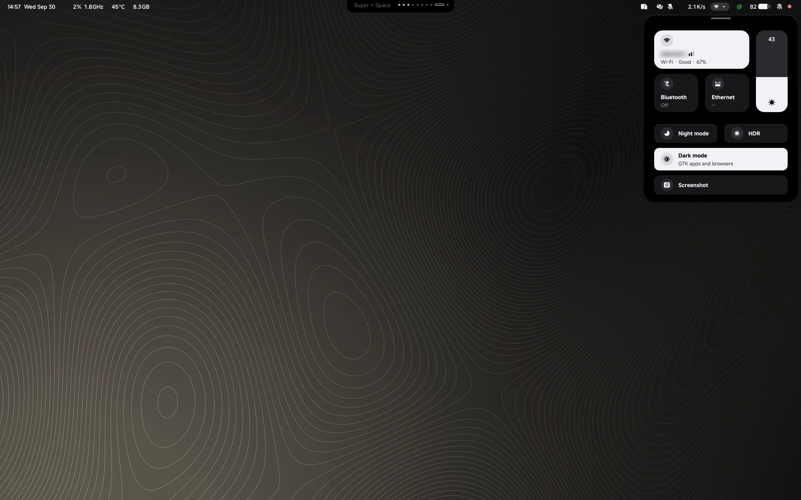](docs/screenshots/v1.0.0/02-balise.webp)<br>**Balise** — network, brightness, night mode, HDR | [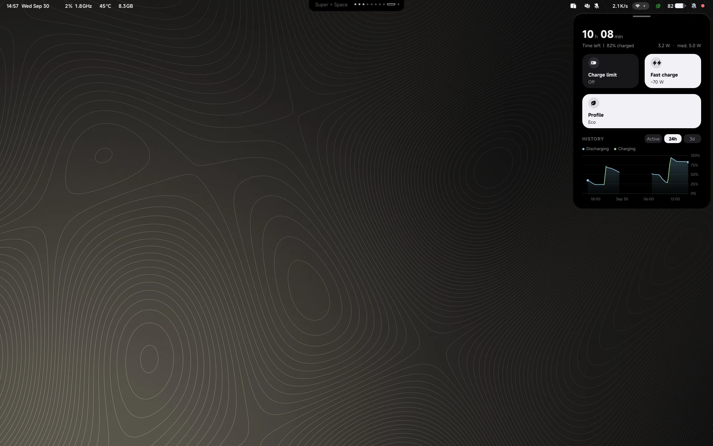](docs/screenshots/v1.0.0/03-power.webp)<br>**Power** — battery, charge limit, profile and history |
| [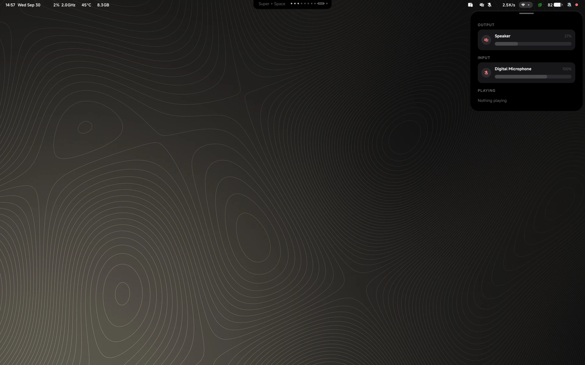](docs/screenshots/v1.0.0/04-mixer.webp)<br>**Mixer** — outputs, inputs and what's playing | [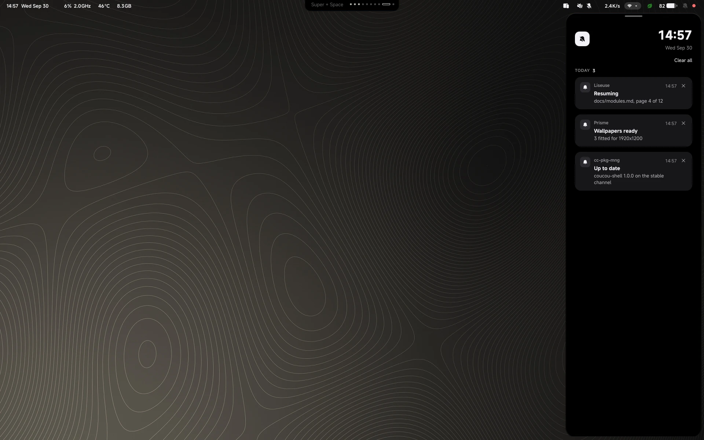](docs/screenshots/v1.0.0/05-notifications.webp)<br>**Notifications** |
| [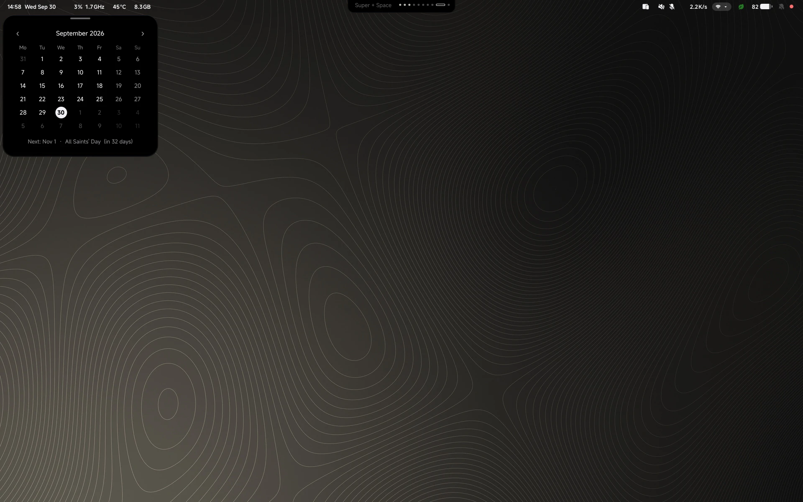](docs/screenshots/v1.0.0/06-calendar.webp)<br>**Calendar** | [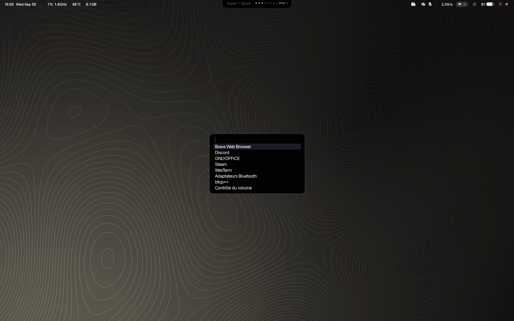](docs/screenshots/v1.0.0/14-launcher.webp)<br>**Launcher** |
| [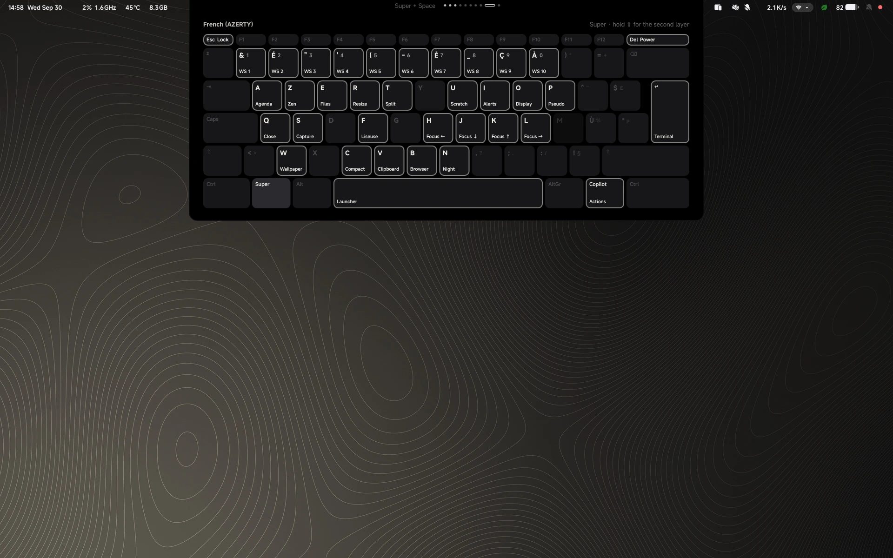](docs/screenshots/v1.0.0/08-keybinds.webp)<br>**Key bindings**, held on `Super` | [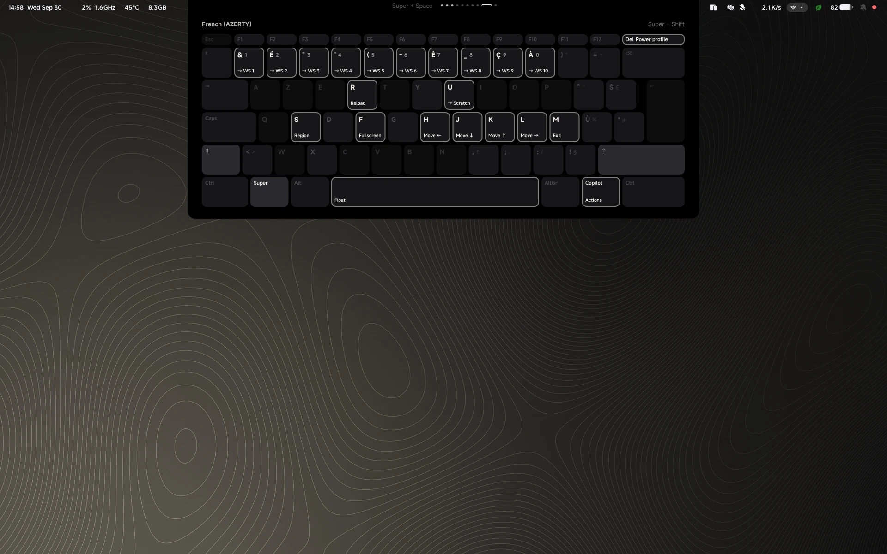](docs/screenshots/v1.0.0/09-keybinds-shift.webp)<br>… and with `Shift` |
| [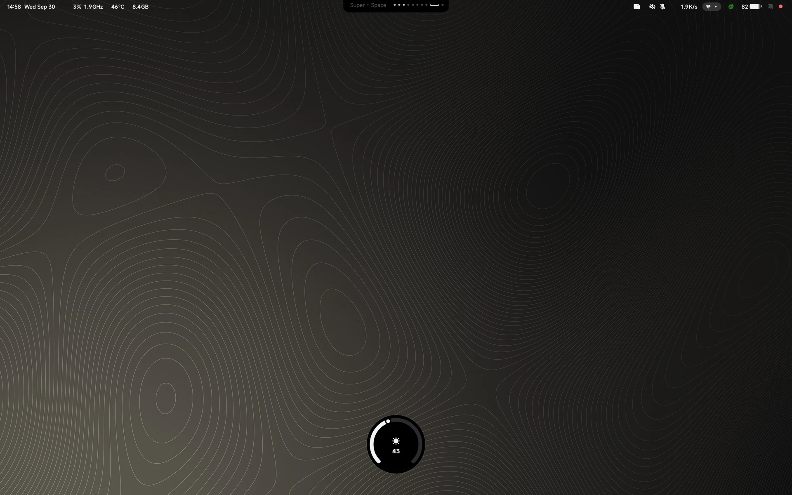](docs/screenshots/v1.0.0/10-osd.webp)<br>**Brightness OSD** | [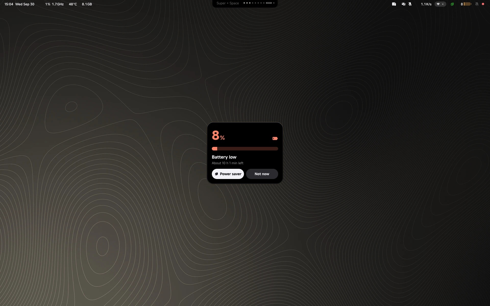](docs/screenshots/v1.0.0/11-battery-alert.webp)<br>**Battery alert** |
| [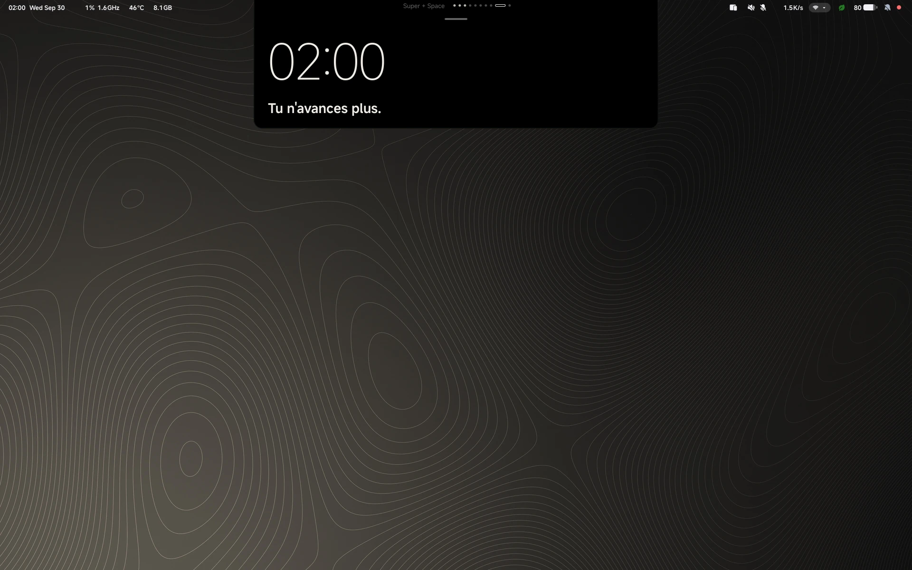](docs/screenshots/v1.0.0/12-veille.webp)<br>**Veille** — the late-night clock | [](docs/screenshots/v1.0.0/13-zen.webp)<br>**Zen mode** |
| [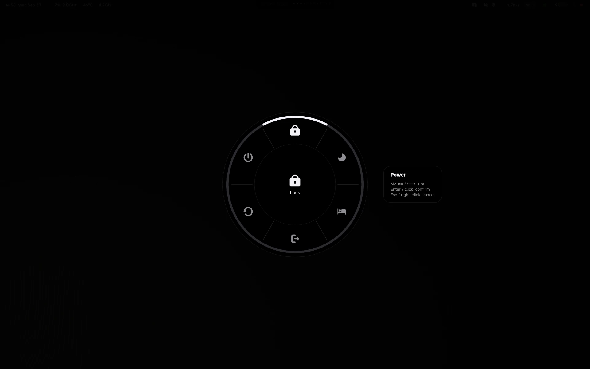](docs/screenshots/v1.0.0/15-roue.webp)<br>**Roue** — the radial wheel | [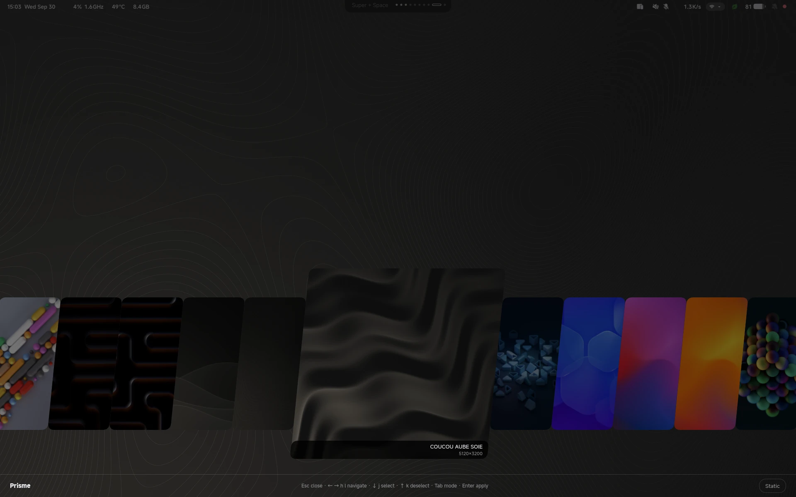](docs/screenshots/v1.0.0/16-prisme.webp)<br>**Prisme** — the wallpaper picker |

[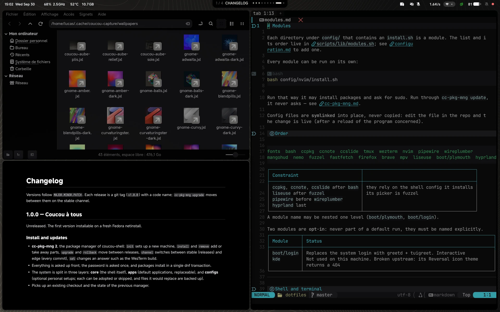](docs/screenshots/v1.0.0/17-work.webp)

## Documentation

| Page | Contents |
|---|---|
| [**Installation**](docs/installation.md) | Installing with dnf, what `init` asks, unattended installs |
| [**cc-pkg-mng**](docs/cc-pkg-mng.md) | Layers, commands, options, channels, upgrade and rollback |
| [**Configuration**](docs/configuration.md) | Editing coucou-shell, environment variables, adding a unit |
| [**Units**](docs/modules.md) | What each part installs, and where to configure it |
| [**Hardware detection**](docs/hardware.md) | CPU/GPU profiles, codec swaps, manual follow-ups |
| [**Key bindings**](docs/keybindings.md) | The full list, AZERTY |
| [**Changelog**](CHANGELOG.md) | What each release brings |

## What's in here

| Piece | What it is |
|---|---|
| **Hyprland** (`config/hyprland/hypr/`) | Compositor config, in Hyprland's Lua API: `hyprland.lua`, `keybinds.lua`, `windowrules.lua`, `monitors.lua`, plus per-machine profiles in `hosts/` and an optional git-ignored `private.lua` |
| **Quickshell bar** (`config/hyprland/quickshell/bar/`) | The status bar: clock and metrics, workspaces and media, and drawers for network, power, audio mixer with per-app equalizer, notifications and calendar |
| **Veille** (`quickshell/bar/modules/veille/`) | A large clock overlay for late sessions, with occasional messages. Configured in `quickshell/bar/veille.json` |
| **Roue** (`config/hyprland/roue-src/`) | Radial wheel: power menu, power profile, display layout, actions |
| **Prisme** (`config/hyprland/prisme-src/`) | Wallpaper picker, and `wallpaper-filter` to fit wallpapers to each screen |
| **Balise** (`config/hyprland/balise-src/` + `quickshell/bar/modules/balise/`) | Rust daemon for NetworkManager/BlueZ, and the bar panel that drives it. Shares a saved network as a QR code. No VPN |
| **Liseuse** (`config/liseuse/`) | Reading library on `Super + F`: a picker over `~/Livres` and the folders in `sources.conf`, opening PDF, EPUB, comics, Markdown (with maths and PlantUML) in zathura. `liseuse convert` turns office documents into PDFs |
| **cc-pkg-mng** (`crates/cc-pkg-mng/`, `units/`) | The package manager: installs the parts you pick, applies only what changed, and moves between releases |
| **Boot** (`config/boot/`) | An optional Plymouth splash, and an optional greetd + tuigreet login with the console in JetBrains Mono |
| Everything else in `config/` | Audio, fonts, theme, fuzzel, and the applications and personal configurations offered at install. See [docs/modules.md](docs/modules.md) |

## Licence

coucou-shell is for personal use: install it, use it and adapt it on your own machines, but don't redistribute it — see [LICENSE.md](LICENSE.md). Third-party parts keep their own licences, listed in [THIRD-PARTY.md](THIRD-PARTY.md).

## Monitors & HDR

After the first launch, check output names with `hyprctl monitors` and adjust `config/hyprland/hypr/monitors.lua` if needed; `hyprctl reload` applies it. HDR is toggled per screen from the Balise drawer.
