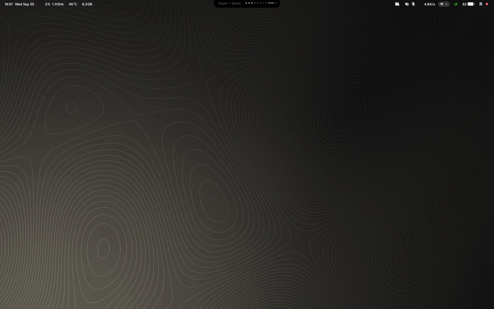

# coucou-shell

My Fedora desktop, built on [Hyprland](https://hyprland.org/), with its own little package manager to install it and keep it up to date. Most of it is configuration for existing tools, but it also comes with four apps I wrote in Rust, three of them with GTK4: **[Roue](config/hyprland/roue-src)**, a radial wheel, **[Prisme](config/hyprland/prisme-src)**, a wallpaper picker, **[Balise](config/hyprland/balise-src)**, which handles Wi-Fi, Bluetooth and Ethernet from a panel in the bar, and **[Manette](config/hyprland/manette-src)**, a small daemon behind the game controller menu.



## Quick start

You need Fedora 44. A minimal netinstall is enough.

```bash
sudo dnf config-manager addrepo --from-repofile=https://lucasssoh.github.io/dotfiles/coucou-shell.repo
sudo dnf install cc-pkg-mng
cc-pkg-mng init
```

After that, two commands cover most days:

```bash
cc-pkg-mng upgrade    # move to the latest release and apply it
cc-pkg-mng status     # check that everything is in place
```

The documentation is also on the web: https://lucasssoh.github.io/dotfiles/

## At work


The bar's drawers, Veille, Roue, Prisme and the boot splash each have their own screenshots in the [units](docs/modules.md) documentation.

## Documentation

| Page | What you'll find |
|---|---|
| [**Installation**](docs/installation.md) | Installing with dnf, the questions `init` asks, unattended installs |
| [**cc-pkg-mng**](docs/cc-pkg-mng.md) | Layers, commands, options, channels, upgrading and rolling back |
| [**Configuration**](docs/configuration.md) | Editing coucou-shell, environment variables, writing your own unit |
| [**Units**](docs/modules.md) | What each part installs, and where its settings live |
| [**Hardware detection**](docs/hardware.md) | CPU and GPU profiles, codec swaps, things left for you to do by hand |
| [**Key bindings**](docs/keybindings.md) | Every shortcut, on an AZERTY keyboard |
| [**Changelog**](CHANGELOG.md) | What changed in each release |

## What's in here

| Piece | What it is |
|---|---|
| **Hyprland** (`config/hyprland/hypr/`) | The compositor config, written with Hyprland's Lua API: `hyprland.lua`, `keybinds.lua`, `windowrules.lua` and `monitors.lua`, plus per-machine profiles in `hosts/` and an optional, git-ignored `private.lua` |
| **Quickshell bar** (`config/hyprland/quickshell/bar/`) | The status bar. Clock and system stats on the left, workspaces and media in the middle, and drawers for the network, power, an audio mixer with a per-app equalizer, notifications and a calendar |
| **Veille** (`quickshell/bar/modules/veille/`) | A big clock that shows up when you're still at it late at night, with the odd message. Its settings are in `quickshell/bar/veille.json` |
| **Roue** (`config/hyprland/roue-src/`) | A radial wheel for the power menu, power profiles, display layouts and quick actions |
| **Prisme** (`config/hyprland/prisme-src/`) | The wallpaper picker, along with `wallpaper-filter`, which fits each wallpaper to each screen |
| **Balise** (`config/hyprland/balise-src/` and `quickshell/bar/modules/balise/`) | A Rust daemon that talks to NetworkManager and BlueZ, and the bar panel that drives it. It can share a saved network as a QR code. There's no VPN support |
| **Manette** (`config/hyprland/manette-src/` and `quickshell/bar/modules/controller/`) | Game controllers: a small Rust daemon that notices them arrive, and the menu their Guide button opens, for Steam, Lutris and your apps |
| **Sésame** (`config/hyprland/sesame-src/` and `quickshell/bar/modules/sesame/`) | Passwords asked for outside a terminal: a small Rust daemon, the session's polkit agent and ssh's and gpg's prompt, and the card that shows which command asks |
| **Liseuse** (`config/liseuse/`) | A reading library on `Super + F`. It lists what's in `~/Livres` and the folders in `sources.conf`, and opens PDFs, EPUBs, comics and Markdown (maths and PlantUML included) in zathura. `liseuse convert` turns office documents into PDFs |
| **cc-pkg-mng** (`crates/cc-pkg-mng/`, `units/`) | The package manager. It installs the parts you choose, only redoes what changed, and moves between releases |
| **Boot** (`config/boot/`) | An optional Plymouth splash, and an optional greetd + tuigreet login screen with the console in JetBrains Mono |
| Everything else in `config/` | Audio, fonts, theme, fuzzel, and the apps and personal setups offered during install. See [docs/modules.md](docs/modules.md) |

## Licence

coucou-shell is for personal use. You're welcome to install it, use it and tweak it on your own machines, but please don't redistribute it. The details are in [LICENSE.md](LICENSE.md). Third-party parts keep their own licences, listed in [THIRD-PARTY.md](THIRD-PARTY.md).

## Monitors and HDR

After your first login, run `hyprctl monitors` to see your screens' names, and adjust `config/hyprland/hypr/monitors.lua` if they don't match. `hyprctl reload` applies the change. HDR can be turned on or off for each screen from the Balise drawer.
