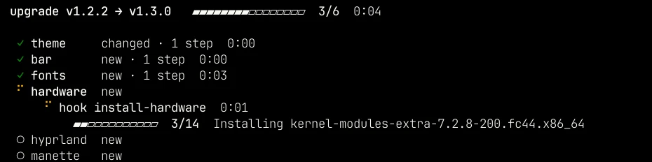
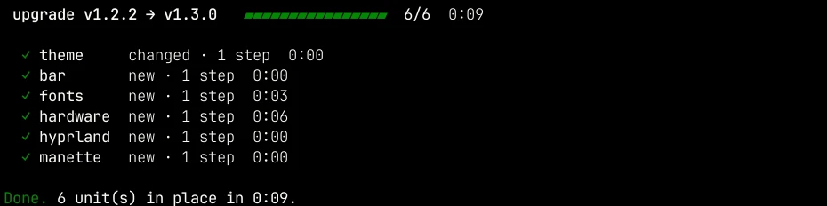
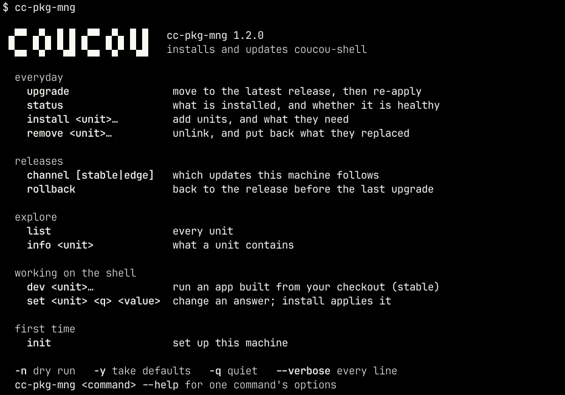

# `cc-pkg-mng`

This is coucou-shell's own package manager. It installs the parts of coucou-shell, keeps them up to date, and lets you move between releases. For the very first install, start with [installation.md](installation.md).

## Everyday use

```bash
cc-pkg-mng upgrade    # move to the latest release (or the latest commit, on edge) and apply it
cc-pkg-mng status     # what's installed, and whether it's in place
```

While it installs or upgrades, the work shows as a live list. Everything to do is listed from the start, the part in progress unfolds with its steps, finished parts fold to one line with their time, and the bar at the top counts them. Package installs show how many packages are done. If something fails, it stays unfolded with its last lines and the path of the full log.





Outside a terminal (a pipe, a file), with `--verbose` or with `-q`, the output stays one line per step. The log in `~/.local/state/coucou-shell/logs/` always has every line.

`cc-pkg-mng` alone, or `--help`, lists the commands by what they are for:



## Units and layers

coucou-shell is split into **units**, grouped in three layers:

| Layer | What's in it | When it's installed |
|---|---|---|
| **core** | The shell itself: Hyprland, the bar, Roue, Prisme, Balise, Manette, Liseuse, fonts, theme, drivers | Always. The login screen and the boot splash are optional |
| **apps** | Default applications: WezTerm, Firefox, Nemo, Neovim, mpv, and a few extras | Only the ones you pick. You can swap any of them for another app |
| **configs** | My personal setups for the shell, WezTerm, Neovim and a few apps | Only if you choose to adopt them |

`cc-pkg-mng list` shows every unit, and `cc-pkg-mng info <unit>` shows what one contains. The [units](modules.md) page describes them all.

## Commands

| Command | What it does |
|---|---|
| `init` | Sets up the machine: the checkout, the channel and the units. See [installation.md](installation.md) |
| `list` | Lists every unit by layer, with `●` next to the installed ones. Takes `--installed` and `--layer core\|apps\|configs` |
| `info <unit>` | Shows what a unit installs, links and runs, and which units it needs |
| `install <unit>…` | Installs units, along with any units they need |
| `remove <unit>…` | Removes units: unlinks their files, restores what they replaced, and turns their services off. Their packages stay installed |
| `status` | Shows the checkout, the channel, and the state of each installed unit: up to date, changed since it was installed, or with broken links |
| `upgrade` | Moves to the latest release (stable) or the latest commit (edge), then applies whatever changed. `--to vX.Y.Z` picks a specific release |
| `rollback` | Goes back to the release you had before the last upgrade (stable only) |
| `channel [stable\|edge]` | Shows the current channel, or switches to another one. The next `upgrade` follows it |
| `dev [<unit>…]` | Runs Roue, Prisme, Balise or Manette built from the checkout you're in, in place of the release's (stable only). With no unit, shows what is running. `--off` goes back to the release's, `--from <path>` builds from another checkout. See [testing your changes](#testing-your-changes-on-stable) |
| `set <unit> <question> <value>` | Changes one of your answers, for example `set wezterm variant smear`. Run `install wezterm` afterwards to apply it |

## Options

| Flag | Effect |
|---|---|
| `-n`, `--dry-run` | Show the plan without changing anything |
| `-y`, `--yes` | Accept every default: no questions, no confirmation |
| `--dir <path>` | Use this coucou-shell checkout. It's remembered for next time |
| `-q`, `--quiet` | Only print warnings and errors |
| `--verbose` | Show the output of every command as it runs |
| `--no-color` | Plain output, no colours |
| `--version` | The manager's version, the release this machine runs, its channel, whether a newer release is out, and the apps running from your checkout |
| `-V` | The manager's version alone, on one line |

## Channels

| Channel | Follows | Roue, Prisme, Balise and Manette |
|---|---|---|
| **stable** | releases (`v1.0.0` and so on) | Installed from coucou-shell's repository, at the version that matches the release |
| **edge** | every commit on the default branch | Built on your machine into `~/.local/bin`, and rebuilt whenever their code changes. The Rust toolchain is installed for this |

Either way, the session starts them from `~/.local/bin`. If you switch from edge back to stable, the local builds there are replaced by the packaged versions.

## Testing your changes on stable

You can stay on stable and still work on Roue, Prisme, Balise or Manette. Keep a separate checkout to code in (for example `~/code/dotfiles`, on `master`), so the one your machine follows stays on its release. Then, from that checkout:

```bash
cc-pkg-mng dev roue       # build Roue from here, and run it instead of the release's
cc-pkg-mng dev            # what is running instead of the release
cc-pkg-mng dev --off      # back to the release's Roue, Prisme, Balise and Manette
```

- **Your shortcuts and the bar use the new build straight away.** There's nothing to change in your configuration. Balise's background service restarts on its own.
- **Run it again after each change.** The first build takes a minute or two; after that, a small change is live in a few seconds.
- **The rest of the machine stays on its release.** Your channel and version don't change, and `upgrade` still moves you from one release to the next. An `install` or `upgrade` that touches the unit puts the release's version back, and its plan says so.
- **`status` shows the dev builds** that are running.
- The first `dev` installs the Rust toolchain and the build dependencies.

On edge, the checkout already is what runs: `cc-pkg-mng install roue` rebuilds what changed.

You can see what each release changed in the [changelog](../CHANGELOG.md).

## How it behaves

- **You see the plan first.** Any command that changes the machine shows you what it's about to do and waits for your OK. Your password is asked once, and all packages go into a single dnf transaction.
- **Only what changed gets redone.** A unit whose files haven't changed since it was applied is left alone. Running the same command twice does nothing the second time.
- **Your files are safe.** If a unit would replace one of your files, that file goes into the backups first, and `remove` puts it back.
- **Local edits block a version change.** If the checkout has uncommitted changes, `upgrade` and `rollback` stop and tell you which files.
- **Nothing gets restarted behind your back**, except the audio stack when its configuration changes. Programs that are already running keep the old version until you restart them. The bar reloads itself.
- **A word about dnf.** A plain `sudo dnf upgrade` will also bring Roue, Prisme, Balise and Manette up to the newest release. dnf only re-reads coucou-shell's repository every couple of days, so on the day a release comes out, use `sudo dnf upgrade --refresh` to see it. Your next `cc-pkg-mng upgrade` then brings everything else up to the same release.

## Files

Everything the manager keeps track of is in `~/.local/state/coucou-shell/`:

| Path | Contents |
|---|---|
| `state.toml` | The checkout, the channel, the version, and each installed unit with your answers |
| `dev/` | The dev builds running in place of the release's, and where each came from |
| `backups/` | Files that units replaced, sorted by date |
| `logs/` | The full output of every run |

## Exit codes

`0` when everything went fine. `1` for any error, such as a step that failed, a plan you cancelled, a unit that doesn't exist, or uncommitted changes in the way.
