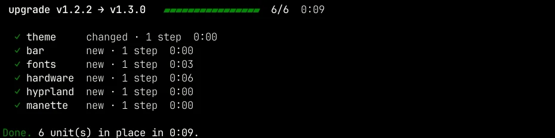
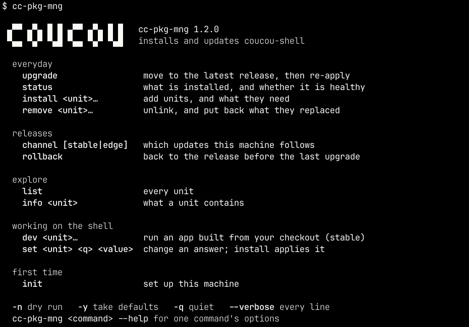

# `cc-pkg-mng`

This is coucou-shell's own package manager. It installs the parts of coucou-shell, keeps them up to date, and moves between releases. For the very first install, start with [installation.md](installation.md).

## Everyday use

```bash
cc-pkg-mng upgrade    # move to the latest release (or the latest commit, on edge) and apply it
cc-pkg-mng status     # what's installed, and whether it's in place
```

An install or an upgrade shows its plan, waits for an OK, then works through four phases on a rail:

| Phase | What happens |
|---|---|
| **check** | The repositories are ready, and the release's packages are published |
| **download** | Every package is resolved and downloaded |
| **packages** | cc-pkg-mng itself first, when the release has a newer one, then the rest |
| **units** | The checkout moves to the new version, then each unit is applied |

Nothing a session runs changes before the units phase. A failure up to there leaves the machine on the release it had. A unit that fails in the units phase is named on the closing line, and the next `upgrade` finishes it.

After an upgrade, the services of the apps whose package changed restart. A new Quickshell restarts the bar. A new Hyprland runs from the next login, and the closing line says so.




In a pipe, with `--verbose` or with `-q`, the output is one line per step. The full log is in `~/.local/state/coucou-shell/logs/`.

### When packages are in the way

| Closing line | Meaning |
|---|---|
| *vX.Y.Z is tagged but not published yet* | The release's packages aren't in the repository yet. Run `upgrade` again later |
| *Packages block vX.Y.Z* | dnf can't install the release next to a package already there. Its reasons are listed. On a terminal, cc-pkg-mng names the packages dnf would remove and asks first. `--allow-erasing` lets dnf remove them without asking |
| *The repositories can't be reached* | No network, or a repository is down |

`cc-pkg-mng` alone, or `--help`, lists the commands by what they are for:



## Units and layers

coucou-shell is split into **units**, grouped in three layers:

| Layer | What's in it | When it's installed |
|---|---|---|
| **core** | The shell itself: Hyprland, the bar, Roue, Prisme, Balise, Manette, Sésame, Liseuse, fonts, theme, drivers | Always. The login screen, the boot splash and Programme are optional |
| **apps** | Default applications: WezTerm, Firefox, Nemo, Neovim, mpv, and a few extras | Only the ones picked. Any of them can be swapped for another app |
| **configs** | The author's setups for the shell, WezTerm, Neovim and a few apps | Only when adopted |

`cc-pkg-mng list` shows every unit, and `cc-pkg-mng info <unit>` shows what one contains. The [units](units.md) page lists them all, with their guides.

## Commands

| Command | What it does |
|---|---|
| `init` | Sets up the machine: the checkout, the channel and the units. See [installation.md](installation.md) |
| `list` | Lists every unit by layer, with `●` next to the installed ones. Takes `--installed` and `--layer core\|apps\|configs` |
| `info <unit>` | Shows what a unit installs, links and runs, and which units it needs |
| `install <unit>…` | Installs units, along with any units they need |
| `remove <unit>…` | Removes units: unlinks their files, restores what they replaced, and turns their services off. Their packages stay installed |
| `status` | Shows the release, the channel and the checkout. When something is off: packages behind the release, an upgrade that stopped half-way, units not applied or with broken links, and the command that fixes it |
| `upgrade` | Moves to the latest release (stable) or the latest commit (edge), then applies whatever changed. `--to vX.Y.Z` picks a specific release. Already there, it finishes what a stopped upgrade left |
| `rollback` | Goes back to the release in place before the last upgrade (stable only) |
| `channel [stable\|edge]` | Shows the current channel, or switches to another one. The next `upgrade` follows it |
| `dev [<unit>…]` | Runs one of coucou-shell's [own apps](#channels) built from the current checkout (stable only). With no unit, shows what is running. `--off` goes back to the release's, `--from <path>` builds from another checkout. See [testing your changes](#testing-changes-on-stable) |
| `set <unit> <question> <value>` | Changes an answer, for example `set wezterm variant smear`. Run `install wezterm` afterwards to apply it |

## Options

| Flag | Effect |
|---|---|
| `-n`, `--dry-run` | Show the plan without changing anything |
| `-y`, `--yes` | Accept every default: no questions, no confirmation |
| `--dir <path>` | Use this coucou-shell checkout. It's remembered for next time |
| `-q`, `--quiet` | Only print warnings and errors |
| `--verbose` | Show the output of every command as it runs |
| `--allow-erasing` | Let dnf remove or replace packages that block the transaction |
| `--no-color` | Plain output, no colours |
| `--version` | The release this machine runs, its channel and checkout, the manager's version, the packages and units, the apps running from a checkout, and the latest release |
| `-V` | The manager's version alone, on one line |

## Channels

| Channel | Follows | coucou-shell's own apps |
|---|---|---|
| **stable** | releases (`v1.0.0` and so on) | Installed from coucou-shell's repository, at the version that matches the release |
| **edge** | every commit on the default branch | Built on the machine into `~/.local/bin`, and rebuilt whenever their code changes. The Rust toolchain is installed for this |

The own apps are Roue, Prisme, Balise, Manette, Sésame, Pouls and Programme.

## Testing changes on stable

To work on one of coucou-shell's own apps while staying on stable, code in a second checkout (`~/code/dotfiles`, on `master`). From that checkout:

```bash
cc-pkg-mng dev roue       # build Roue from here, and run it instead of the release's
cc-pkg-mng dev            # what is running instead of the release
cc-pkg-mng dev --off      # back to the release's apps
```

- Shortcuts and the bar use the new build at once.
- Run `dev` again after each change. The first build takes a minute or two, the next ones a few seconds.
- An `install` or `upgrade` that touches the unit puts the release's version back.
- `status` lists the dev builds that are running.

On edge, `cc-pkg-mng install roue` rebuilds what changed.

What each release changed is in the [changelog](../CHANGELOG.md).

## What to expect

- A command that changes the machine shows its plan and waits for an OK. The password is asked once.
- One command changes the machine at a time. A second one stops and says which one is running.
- A unit whose files haven't changed is skipped.
- A user file that a unit replaces goes to the backups. `remove` puts it back.
- `upgrade` and `rollback` stop when a file of the checkout has changed, and list the files. See [keep a change through an upgrade](configuration.md#keep-a-change-through-an-upgrade).
- The bar reloads itself, and the sound cuts out for a moment when the audio configuration changes. Other running programs keep their old version until they restart.
- `sudo dnf upgrade` updates coucou-shell's own apps too. Run `cc-pkg-mng upgrade` afterwards to bring the rest to the same release.

## Files

Everything the manager keeps track of is in `~/.local/state/coucou-shell/`:

| Path | Contents |
|---|---|
| `state.toml` | The checkout, the channel, the version, an upgrade under way, and each installed unit with its answers |
| `lock` | Held while a command changes the machine |
| `dev/` | The dev builds running in place of the release's, and where each came from |
| `backups/` | Files that units replaced, sorted by date |
| `logs/` | The full output of every run |

## Exit codes

`0` when everything went fine. `1` for any error, such as a step that failed, a cancelled plan, a unit that doesn't exist, uncommitted changes in the way, or another cc-pkg-mng running.
