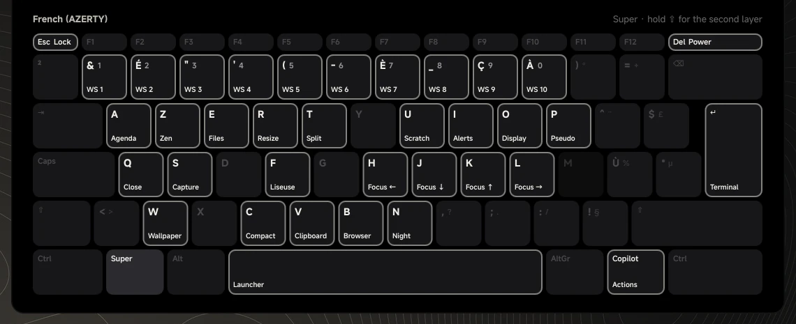
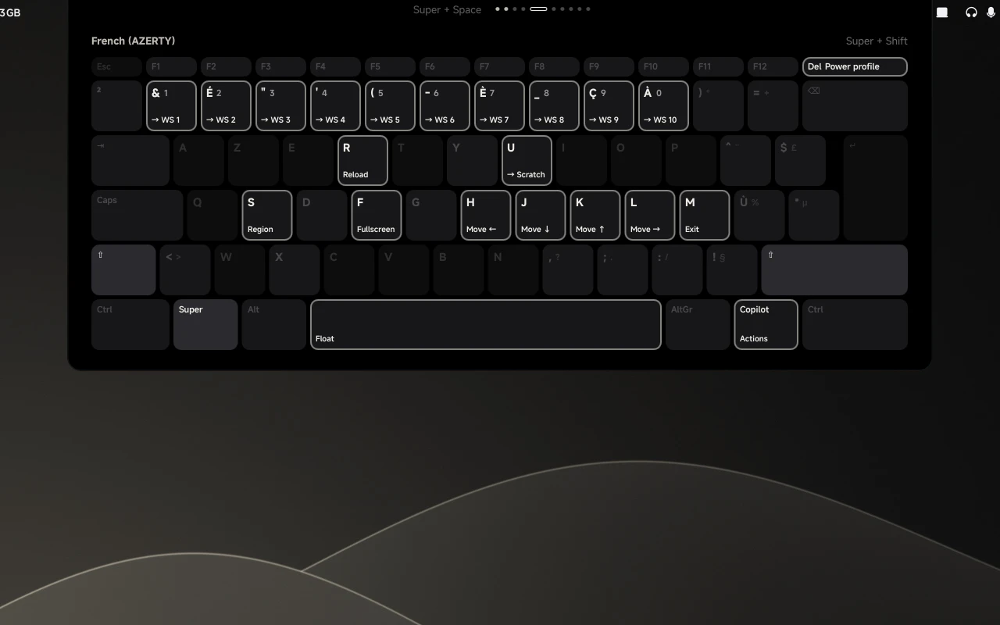

# Key bindings

These are for an AZERTY keyboard. The bindings themselves are defined in [`config/hyprland/hypr/keybinds.lua`](../config/hyprland/hypr/keybinds.lua). If you read that file, the key names there (`ampersand`, `eacute`, …) are the characters the AZERTY number row types, not physical keys 1 to 10.

You don't have to remember any of this: hold `Super` and the bar shows every binding on a keyboard. Add `Shift` to see the `Shift` layer. Let go and it disappears.

## Launching

| Binding | Action |
|---|---|
| `Super + Enter` | Terminal (WezTerm by default) |
| `Super + Space` | App launcher (fuzzel) |
| `Super + E` | File manager (Nemo by default) |
| `Super + B` | Web browser (Firefox by default) |
| `Super + W` | Prisme, the wallpaper picker |
| `Super + F` | Liseuse: picks up the book you were reading, or lets you choose one. Press `F1` inside a book for its manual |
| `Super + V` | Clipboard history (cliphist, through fuzzel) |
| `Super + A` | Agenda: add or delete an event (khal, through fuzzel) |
| `Super + D` | Boussole's drawer, with the [`boussole`](modules.md#boussole) unit |
| `Super + Shift + D` | Boussole's quick add: an exam, a hand-in, a task or a busy slot in one line |

The terminal, file manager and browser are whatever the machine's defaults are. See [default applications](modules.md#default-applications) to change them.

## Screenshots

| Binding | Action |
|---|---|
| `Super + S` | Whole screen, annotated in `satty`, then copied to the clipboard |
| `Super + Shift + S` | Pick a region with `slurp`, annotate it, then copy it to the clipboard |

## Roue, the radial wheels

Press the keys, aim while you hold them, and let go to confirm.

| Binding | Wheel |
|---|---|
| `Super + Delete` | Power menu |
| `Super + Shift + Delete` | Power profile |
| `Super + O` | Display layout |
| `Copilot` key | Actions wheel. Press the same key again to close it |

## Windows

| Binding | Action |
|---|---|
| `Super + Q` | Close the window |
| `Super + H` / `J` / `K` / `L` | Focus left / down / up / right |
| `Super + Shift + H/J/K/L` | Move the window in that direction |
| `Super + Shift + F` | Fullscreen |
| `Super + Ctrl + F` | Maximise |
| `Super + Shift + Space` | Float or tile the window |
| `Super + P` | Pseudo-tile |
| `Super + T` | Switch the split direction |
| `Super + R` | Resize mode. Use `H/J/K/L` to resize, and `Escape` or `Enter` to leave |
| `Super + left-drag` | Move the window |
| `Super + right-drag` | Resize the window |

## Workspaces

| Binding | Action |
|---|---|
| `Super + 1..0` | Go to that workspace |
| `Super + Shift + 1..0` | Send the window there |
| `Super + scroll` | Previous / next workspace |
| `Super + C` | Compact the workspaces: the occupied ones move up to fill the gaps |
| `Super + U` | Show or hide the `magic` scratchpad |
| `Super + Shift + U` | Send the window to `magic` |

## Shell and session

| Binding | Action |
|---|---|
| `Super + Z` | Zen mode: hides the bar |
| `Super + N` | Night mode |
| `Super + I` | Notification centre |
| `Super + Escape` | Lock the screen (hyprlock) |
| `Super + Shift + R` | Reload Hyprland's config (`hyprctl reload`) |
| `Super + Shift + M` | Quit Hyprland |

## Media and hardware keys

Mute, mic mute and the playback keys also work while the screen is locked.

| Key | Action |
|---|---|
| Volume up / down | `wpctl`, in 5 % steps, never above 100 % |
| Mute / mic mute | Toggles through `wpctl` |
| Brightness up / down | [`brightness.sh`](../config/hyprland/hypr/scripts/brightness.sh). It never goes all the way to 0, so the screen can't go black by accident |
| Play / pause, previous, next | `playerctl` |

## Touchpad

| Gesture | Action |
|---|---|
| Three-finger swipe left or right | Previous / next workspace |
