# Units

coucou-shell is installed as **units**, in three layers:
- the **core**, which is always installed (only the login screen and the boot splash are optional);
- **applications**, the ones you pick;
- **configurations**, the personal setups you choose to adopt.

`cc-pkg-mng info <unit>` shows exactly what a unit installs, links and runs. To install or remove one, see [cc-pkg-mng.md](cc-pkg-mng.md).

Configuration files are **linked** from the checkout, never copied. Edit a file in the checkout, and the change takes effect as soon as the program reloads it.

---

## Core

### `base`

The Fedora foundation: shell utilities, NetworkManager, Bluetooth, the PipeWire stack, Mesa and Vulkan, input, storage (NTFS and exFAT), D-Bus and polkit, xdg, the GTK and Qt libraries, and snapd. It turns on NetworkManager and Bluetooth. On a fresh machine, it upgrades the system first.

### `hardware`

Drivers and tools for your CPU and GPU, plus the RPM Fusion codec swaps that enable hardware video decoding. See [hardware.md](hardware.md).

### `fonts`

Downloads the JetBrains Mono, Iosevka and Cascadia Code Nerd Fonts and MiSans Latin into `~/.local/share/fonts/` if they're missing, along with the icon fonts the bar uses (Phosphor, Lucide, MingCute, GoogleSansCode Nerd Font Mono). It also links the fontconfig rule and sets the interface font.

### `theme`

Gives every GTK3 app (Nemo, the file chooser) the bar's colours, through a generated `Adwaita-dark` theme in `~/.local/share/themes/` that follows the desktop's light or dark setting. It also brings the Papirus icons, Comix Cursors (built if `~/.icons/ComixCursors-White` is missing) and the Qt settings.

| To change | Edit this, then run `cc-pkg-mng install theme` |
|---|---|
| The colours | [`theme/build-adwaita-dark.py`](../config/nemo/theme/build-adwaita-dark.py), which takes them from `quickshell/bar/theme/DrawerTheme.qml` |
| Nemo's own styling | [`theme/overlay.css`](../config/nemo/theme/overlay.css). Restart Nemo to see it |

### `audio`

Links [`50-equalizer.conf`](../config/pipewire/50-equalizer.conf), which holds the four five-band filter chains (60, 250, 1k, 4k and 12k Hz) behind the mixer's equalizer. It also links the WirePlumber Bluetooth policy and runs `bt-audio-switch` as a `systemd --user` service.

When this configuration changes, **the audio stack is restarted**, so the sound cuts out for a moment.

If you add a node to the equalizer file, keep the `eq_slot_` or `eq_out_` prefix in its name. Otherwise the bar will think it's a real output device.

### `hyprland`

The compositor and the session: Hyprland, hyprlock, hypridle, hyprsunset, the portals, the brightness and power-profile tools, and the wallpaper slideshow, which runs as `systemd --user` services. It also adds the wallpapers from [`wallpapers/`](../wallpapers/) to `~/Images/Wallpapers`.

#### Configuration files

They're all in [`config/hyprland/hypr/`](../config/hyprland/hypr/). `hyprctl reload` (`Super + Shift + R`) applies the Lua files.

| File | What's in it |
|---|---|
| `hyprland.lua` | General settings, input, animations, gestures |
| `keybinds.lua` | Key bindings, listed in [keybindings.md](keybindings.md) |
| `windowrules.lua` | Window rules |
| `monitors.lua` | Screens, resolutions and positions. Check the names with `hyprctl monitors` |
| `colors.lua` | The shared colour palette |
| `private.lua` | Anything specific to this machine that isn't worth committing, like rules for particular games. It's optional and git-ignored, and it's loaded last when it exists |
| `hypridle.conf` | What happens when you're idle: dim, lock, screen off, suspend |
| `hyprlock.conf` | The lock screen |
| `hyprsunset.conf` | Night mode |
| `hosts/*.env` | Per-machine behaviour, see below |
| `wallpaper-playlist.json` | The wallpaper slideshow |

#### Per-machine profiles

`hosts/default.env` is loaded on every machine. Then, if there's a `hosts/<id>.env` for this machine, it's loaded on top. The id comes from the DMI product name, or from `HOST_PROFILE` if you set it.

| Variable | Default | Effect |
|---|---|---|
| `IDLE_ENABLED` | `1` | Set it to `0` and hypridle does nothing at all |
| `IDLE_ALLOW` | `dim undim lock dpms-off dpms-on suspend` | The idle actions this machine is allowed to take |
| `IDLE_REQUIRE_BATTERY` | `1` | Only act when the machine has a battery |

```bash
~/.config/hypr/scripts/host-profile.sh --report    # which profile is used, and with which values
```

To add a machine, create `hosts/<id>.env` with only the values that differ from the default. Then add its product name to `host_profile_id` in [`scripts/host-profile.sh`](../config/hyprland/hypr/scripts/host-profile.sh).

#### Default applications

`Super + Enter`, `Super + E` and `Super + B` open whichever app fills that role (the `roles` unit), through [`coucou-open`](../config/hyprland/hypr/scripts/coucou-open):

| Role | Default | To change it |
|---|---|---|
| Terminal | WezTerm | List desktop ids in `~/.config/xdg-terminals.list`, favourite first (for example `kitty.desktop`) |
| Web browser | Firefox | `xdg-settings set default-web-browser brave-browser.desktop` |
| File manager | Nemo | `xdg-mime default org.gnome.Nautilus.desktop inode/directory` |

```bash
~/.config/hypr/scripts/coucou-open --print terminal   # what Super+Enter would open
```

#### Idle

While a zathura window is visible, the screen won't dim, lock or turn off. A book left open on another workspace doesn't count. See [`readinghold.lua`](../config/hyprland/hypr/readinghold.lua).

### `bar`

The bar is built with Quickshell, in [`config/hyprland/quickshell/bar/`](../config/hyprland/quickshell/bar/), and reloads itself whenever a QML file changes. This unit also brings the screenshot tools (grim, slurp, satty) and the clipboard history. It also brings **fontview**, a font viewer as simple as imv: open a font file from Nemo or run `fontview FILE`; `←` `→` step through the fonts in the folder, `+` `−` change the size, `q` quits.

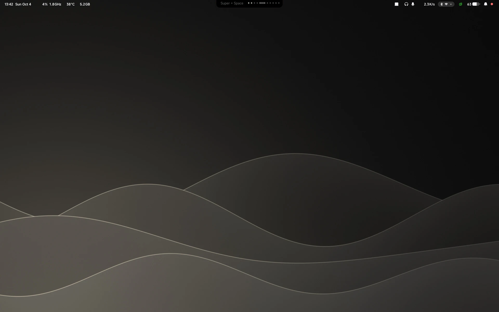

| Area | What's there |
|---|---|
| Left | The clock (click it for the calendar and agenda), CPU, temperature, fan speed (hidden if the machine has no fan sensor), memory |
| Centre island | The active window, workspaces, and what's playing |
| Launchers | Your open apps. Right-click one to focus, close or quit it |
| Right | HDR, audio output and input, network rate, Balise, power profile, battery, notifications |

#### Drawers

| Drawer | Opens from | What's in it |
|---|---|---|
| Calendar | the clock | The month, your khal agenda and reminders |
| Notification centre | the bell, or `Super + I` | Notifications grouped by app, do not disturb, media controls, clear all |
| [Balise](../config/hyprland/quickshell/bar/modules/balise/) | its button | Wi-Fi, Bluetooth and Ethernet with their device lists; brightness, night mode and HDR; dark mode; a screenshot button |
| [Power](../config/hyprland/quickshell/bar/modules/power/) | the battery | Time left, charge limit, fast charge, power profile, and a history of the charge |
| [Mixer](../config/hyprland/quickshell/bar/modules/mixer/) | either audio icon | Output and input levels, device lists, volume and equalizer for each app |

| | | |
|:---:|:---:|:---:|
| 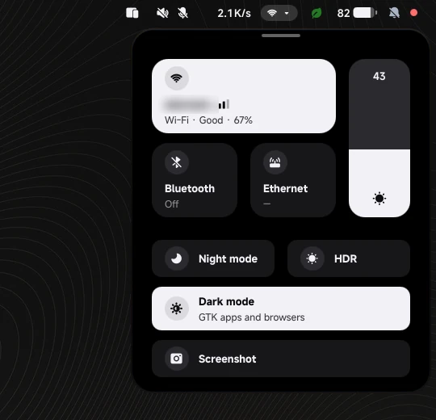<br>Balise | 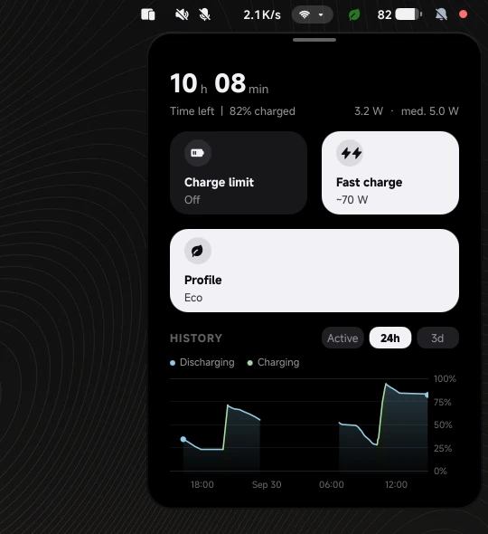<br>Power | 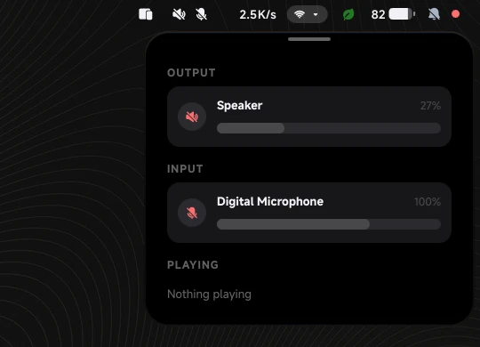<br>Mixer |
| 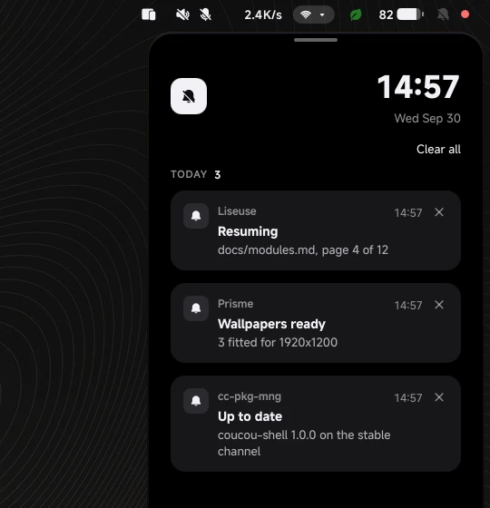<br>Notification centre | 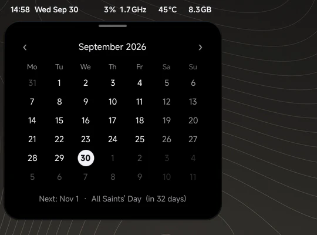<br>Calendar | |

The notification centre is a panel from under the bar to the bottom of the screen, flush with its right edge, sliding in from the right. Only one of the drawers on the right can be open at a time.

Hold `Super` and the centre island turns into a keyboard showing every key binding. Press `Shift` as well to see the second layer. The full list is in [key bindings](keybindings.md).

#### Indicators

| | |
|:---:|:---:|
| 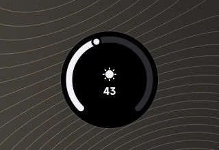 | 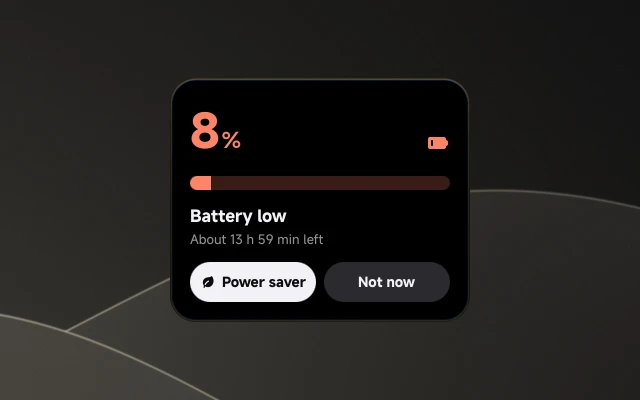 |
| When you change the volume, the microphone level or the brightness, a dial shows up at the bottom of the screen | The battery alert shows up at 20 %, 10 % and 5 % while on battery. You can switch to the power saver profile, or dismiss it |

#### Mixer and equalizer

- Right-click an audio icon to open pavucontrol, for card profiles and moving streams between devices.
- When you plug in a new output or input, it becomes the default.
- Each app gets its own equalizer. Click the chevron on an app's row to open it: five bands, ten presets and an on/off switch. Up to four apps can have an equalizer at the same time (the filter chains come from the `audio` unit).
- Your curves are saved by app name in `~/.local/state/bar-equalizer.json`.

#### Veille

A big clock that appears when you're up late, with the occasional message.

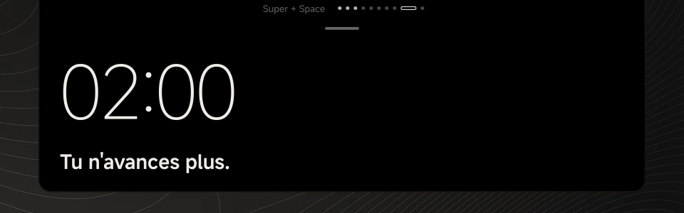

Its settings are in [`quickshell/bar/veille.json`](../config/hyprland/quickshell/bar/veille.json), and changes apply as soon as you save:

| Key | Controls |
|---|---|
| `enabled`, `language`, `monitor` | On or off, the language of the messages, and which screen it shows on (empty means the focused one) |
| `showSeconds`, `showDate` | How the clock looks |
| `messageIntervalMinutes`, `messageHoldSeconds`, `curatedRatio` | How often messages appear |
| `thresholds` | The time each phase starts |
| `phases` | Whether it shows, and how it looks, in each phase |
| `muteWhileGaming`, `respectZenMode` | When it stays out of the way |

#### Agenda

`Super + A` lets you add or delete an event through fuzzel. Events are stored by khal (its config is in [`config/hyprland/khal/config`](../config/hyprland/khal/config)). The calendar drawer shows them and rings their reminders.

### `roue` · `prisme` · `balise`

The three apps written for coucou-shell. On the stable channel they're installed as packages. On edge they're built on your machine from [`roue-src`](../config/hyprland/roue-src/), [`prisme-src`](../config/hyprland/prisme-src/) and [`balise-src`](../config/hyprland/balise-src/).

| App | What it does | Settings |
|---|---|---|
| **Roue** | A radial wheel: press, aim, let go. Used for the power menu, power profiles, display layouts and actions | [`config/hyprland/roue/`](../config/hyprland/roue/) |
| **Prisme** | The wallpaper picker (`Super + W`). Each wallpaper is fitted to the resolution of every connected screen and stored in `~/.cache/filtered_wallpapers/<W>x<H>/`. This happens at install, and again when you plug in a new screen. Until then, that screen shows the original. A wallpaper that comes in light and dark, `<name>.jpg` next to `<name>-dark.jpg` (the extensions can differ), is one card: it shows the version for the current mode, opens on both when you land on it, and the desktop switches version when you switch between light and dark mode. Name your own wallpapers the same way to pair them | [`config/hyprland/prisme/`](../config/hyprland/prisme/): `wallpapers.conf` (which folder to use) and `wallpapers-extra.conf` (extra folders to include) |
| **Balise** | The network and Bluetooth service behind the bar's Balise drawer, running as a `systemd --user` service. `balise wifi-share <ssid>` prints a QR code for a saved network | [`config/hyprland/balise/`](../config/hyprland/balise/) |

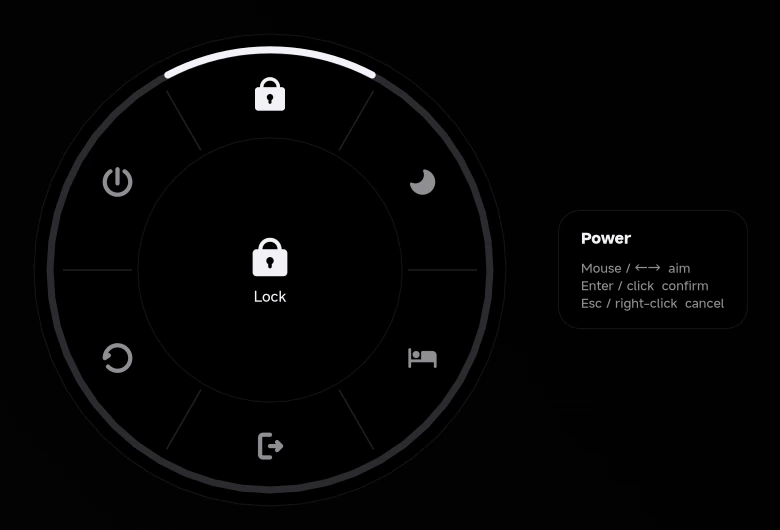

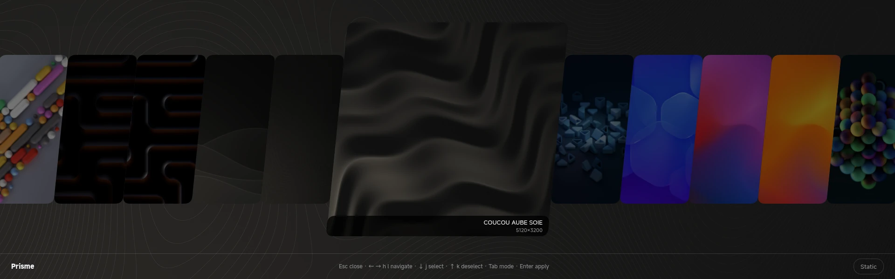

### `manette`

Game controllers in the shell. Plug one in or pair it over Bluetooth, and a pill at the bottom of the screen says it's connected. Xbox, PlayStation, Switch and Steam controllers all work, and so does any other pad Linux recognises as one. Over USB, Xbox controllers need the `xpad` driver, which this unit installs (`kernel-modules-extra`): restart once after installing it.

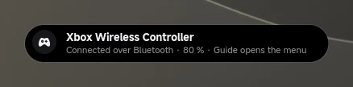

Press the **Guide button** (the Xbox, PS or Home logo) to open the controller menu:

| Row | What it holds |
|---|---|
| **Continue** | The game you played last, with its artwork. `A` starts it |
| **Library** | Your other games, Steam and Lutris together, plus any game another launcher (Heroic, Bottles, itch…) put in the applications menu |
| **Launchers** | Steam (opens in Big Picture), Lutris, Heroic, Bottles, itch: the ones installed |
| **System** | Apps, Sleep, and Turn off for a Bluetooth controller |

| | |
|:---:|:---:|
|  | 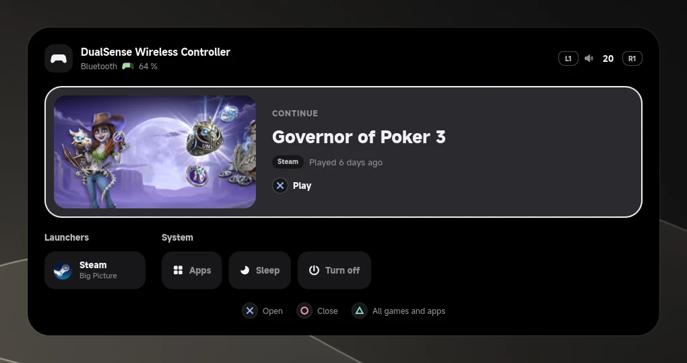 |
| With an Xbox controller | With a PlayStation controller, charging |

Games start straight from the menu, without opening Lutris's window. Steam starts quietly in the background, since it must be running for its games. `Y` opens every app and game in a grid, with a tab for each source: `LT` `RT` switch tabs, `X` jumps to the next letter. Steam and Lutris come with the [`games`](#games) unit.

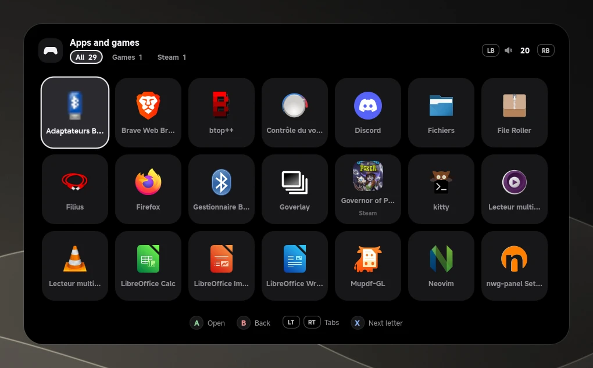

While a controller is connected, its silhouette sits at the start of the bar's right-hand group, next to `hdr`, and fills up like a battery gauge: green while charging, red under 15 %. A wired controller with no battery to report is drawn as an outline.

| | |
|:---:|:---:|
| 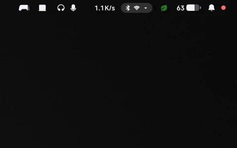 |  |
| On battery | Charging |

The menu shows your controller's own buttons: letters in their colours on an Xbox pad, the four shapes on a PlayStation one, and dots marking the position on a pad it doesn't know.

| Button | In the menu |
|---|---|
| D-pad, left stick | Move |
| Bottom button (`A` on Xbox, ✕ on PlayStation, `B` on Switch) | Open |
| Right button (`B`, ○, `A` on Switch) | Back, or close |
| Top button (`Y`, △, `X` on Switch) | All apps and games |
| Left button (`X`, □, `Y` on Switch) | In the grid, next letter |
| Shoulder buttons (`LB` `RB`, `L1` `R1`, `L` `R`) | Volume down, up |
| Triggers (`LT` `RT`, `L2` `R2`, `ZL` `ZR`) | In the grid, previous and next tab |
| Guide | Close |

While the menu is open, the game behind it receives nothing from the controller. The keyboard and mouse work in it too (arrows, `Return`, `Esc`).

Over Steam or a fullscreen game, a short press on Guide is left to the game: **hold Guide** to open the menu there. A controller without a Guide button opens it with `Select` + `Start` held together. If Steam also reacts to Guide outside a game, turn off *Guide button focuses Steam* in Steam's controller settings.

`qs -c bar ipc call bar controllerMenu` opens or closes the menu without a controller, so you can bind it to a key.

The service behind it runs as `systemd --user` (`manette.service`). It's built from [`manette-src`](../config/hyprland/manette-src/) on edge and installed as a package on stable, like Roue, Prisme and Balise.

### `sesame`

Sésame brings every password asked for outside a terminal to one card in the middle of the screen. It shows what asks and which command asked for it, then waits for you. `su` and `sudo` keep asking in the terminal.

| Who asks | When | The card |
|---|---|---|
| **The system** (polkit) | An app or a command needs administrator rights: `pkexec`, a service to start, a setting in Balise | Your password |
| **ssh** | A `git push`, `git pull` or `ssh` to a server, with a passphrase-protected key | The key's passphrase, or a host to trust |
| **git** | Signing in to a remote over HTTPS | User name and password |
| **gpg** | Signing or decrypting with a protected key | The key's passphrase |

Under **Asked by**, the card lists the processes behind the request, the one asking last. Run by an agent, a push reads `claude › git push origin master › ssh git@github.com …`. `Return` answers and `Esc` cancels; the command then fails as if you had typed nothing. While the card is up, it takes the keyboard and the mouse.

No key is kept in memory, so every push asks again. That way nothing pushes without you. ssh and git use the card from the terminal too (`SSH_ASKPASS`, set in [`hyprland.lua`](../config/hyprland/hypr/hyprland.lua)). gpg uses it unless `gpg-agent.conf` already sets a `pinentry-program`; on a text console, gpg falls back to its usual pinentry.

`qs -c bar ipc call bar sesameDemo polkit` shows the card with a made-up request (`ssh`, `polkit`, `gpg`, `retry` or `confirm`), so you can look at it. Answering it sends nothing.

The service behind it runs as `systemd --user` (`sesame.service`). It's built from [`sesame-src`](../config/hyprland/sesame-src/) on edge and installed as a package on stable, like Manette.

### `boussole`

A study planner in the bar, optional (`init` asks). It reads your course folder and your timetable, plans study sessions around your courses and your evenings, rings them, and follows them through [Liseuse](#liseuse). It never writes in the course folder.

**In the bar.** Right of the clock: the next session and what it is about (`A&C · 20:30`, `Alternance · 20:30`), outlined with a countdown in its last 15 minutes, then `now` while it waits to be started. During a session, a ring that empties over a 25-minute Pomodoro, with its 5-minute break. `2 à déclarer` with a red dot when sessions were left open. Click it, or press `Super + D`, for the drawer.

**Alerts.** A session's start opens in the bar's central island, like Veille, with a chime: `Start`, `At 21:00`, `Not tonight`. It stays until you answer, comes back 15 minutes later if nothing started, and waits out a fullscreen game or zen mode. The evening before, a notification sums up tomorrow; a course cancelled or moved in the timetable, today or tomorrow, gets one too. Nothing after the latest end of the evening.

**The drawer.** A panel from under the bar to the bottom of the screen, flush with its left edge, sliding in from the left.

| Tab | What it holds |
|---|---|
| **Today** | The session under way or the next one, sessions left open, then the day: courses, sessions, free periods at school |
| **Week** | The seven days ahead |
| **Progress** | Per subject: sheets studied, exercises solved alone, reviews waiting, the next exam and the sessions to spare before it |
| **Files** | New files, waiting for you to plan or ignore them, then every file by subject |
| **More** | Exams and hand-ins, projects, campaigns, subjects, calendars, rhythm and periods, settings, and the first run again |

**One thing at a time.** Each task is a session of its own: an evening of applications then a tutorial to prepare is two sessions, one after the other, each with its own `Start`, `Later`, `Not tonight` and close. `Not tonight` puts off that task alone, until tomorrow, and the rest of the evening stays. Said by mistake, it comes back with **Bring back** under Today (`boussole unskip ID`). While one session is under way, the next ones keep quiet.

**Free time.** With nothing planned right now, Today opens on what would help most: in a free period at school, up to its end and on paper; on an evening, each suggestion its own length. The nearest tutorial to prepare comes first, then the subject furthest behind its exam, then a subject you said you are behind in; or pick any subject's next task. It only shows when you open the drawer; planned sessions keep their alerts.

**I have time.** Under Today, pick the most useful work or one subject, then 30 minutes to an hour and a half: a session starts right away, even on an evening you had said no to. A subject gives its next task in the plan's order. `boussole free 45` (or `boussole free 45 A&C`) and `libre 45m` in the quick add do the same.

**A session.** `Start` opens the sheet in Liseuse at the planned section. Boussole counts the pages Liseuse shows on screen (not the window in front), leaves out the time without keyboard or mouse for 5 minutes, and pauses while a game runs. A video playing is asked about when you close. Closing Liseuse ends nothing: work goes on on paper. **Close**, in the drawer, is pre-filled with what Liseuse saw: confirm the section understood, each exercise (solved alone, with the solution, failed), how it went and a note. The plan follows: reviews at about 7 and 21 days, failed exercises back 3 days later without the solution, stuck becomes a question to ask.

**Focus mode.** Off by default; turn it on in More › Rhythm. Starting a session then takes you to the study workspaces (11 to 14), a dimension of their own that the bar shows instead of yours while you are there. The session's file opens in Liseuse, and a fixed panel down the left edge of each study workspace (it steps aside while the drawer is open) holds the time left, the objective, the page on screen, the evening's files, `Next file`, `Pause` and `Close`. Your own workspaces are left as they are: Pause and Close bring you back to where you were, Resume takes you there again. `Next file` opens the close first, then the evening's next file in place of the current one; on the last page of a file, the panel offers it. Liseuse, a course file in Neovim, and what you said was for the session count there; anything else is asked about as anywhere, and a video playing is asked about after 30 seconds, even beside the sheet. In it, `Super + 1` to `4` (the first four keys of the number row) reach the study workspaces, `Super + Shift`, the wheel and the 3-finger swipe stay there too; nothing but Boussole crosses between the two, and a swipe past the edge brings you back. Notifications keep quiet there: no pop-ups and no notification centre, everything waits in the history. Closing Liseuse there ends nothing: the panel offers to open the sheet again or to go on on paper (the time counts, nothing is asked), and without an answer the island asks after the same delay as a detour.

**Away from the sheet.** When something outside the study workspaces has the screen for a while, Boussole asks in the island whether it is for the session: for this session, for another course or project, or personal (back to the sheet, or pause). It asks after 10 minutes when nothing presses, 6 when the subject is one you are behind in or the margin is tight, 3 when the exam is close; coming back to the sheet starts the count again. The answer is kept: something personal gets a reminder next time rather than the question, and personal time is taken out of the session. Neovim tells Boussole which file it edits (a file in the course folder always counts for its course); for other windows, the title is enough.

**Where you stand.** In More › Subjects, each subject has a level: *Behind* gets more time per sheet and goes first, *Unsure* a little of both, *Fine* nothing special, and *Tutorials only* has nothing to read: only its tutorials to prepare, its projects and its exams. From a terminal: `boussole subject level A&C behind` (`behind`, `shaky`, `fine`, `td-only`). Each subject also says how fast its sheets go (quick, as estimated, long), and a course subject can have its sheets only read, its exercises left to the exercise files and tutorials (`boussole subject lessons RESEAUX on`).

**The days.** Weekday evenings, two blocks on Sunday, Saturday as a bonus that is never counted, and Friday evening free. A school day whose courses end by the midday break gives its afternoon a 90-minute block (`boussole rhythm half_day_minutes 0` turns it off). A campaign's daily time goes to a free period at school, a free afternoon or the morning before the evening, and never to a free evening.

**First run.** Under Today, five steps: language and course folder, the timetable's iCal link and your groups (ticked, never typed), which courses go with which folder, your rhythm, ready. Every setting is in **More** afterwards, and `boussole help` lists the same from a terminal.

**Quick add** (`Super + Shift + D`, or `boussole add` in a terminal) reads one line and shows what it understood before keeping it:

| Line | Adds |
|---|---|
| `examen L&MC 18/12` | an exam |
| `cc OC 12/11 14h` | a test, prepared 3 days ahead |
| `rendu ARGOS 12/11 30h` | a hand-in with its hours of work |
| `indispo sam 14h-18h` | a busy slot |
| `tâche relire TD3 A&C 45m` | a task |
| `candidature Entreprise F` | a company in the running campaign |
| `libre 1h` | what fits in an hour you did not expect |

**Games during a session.** Launched from the [controller menu](#manette) or the launcher (`Super + Space`), a game asks first: launching anyway pauses the session. A game started from Steam directly is noticed, not stopped. Turn it off in More › Settings.

**Calendars.** Sessions go to khal's `etude` calendar and your courses to `cours`, so both show in the calendar drawer; your own events (`Super + A`) count as busy.

Settings live in `~/.config/boussole/settings.json` and your history in `~/.local/share/boussole/`; both are written by the app. The service runs as `systemd --user` (`boussole.service`), built from [`boussole-src`](../config/hyprland/boussole-src/) on edge and installed as a package on stable.

### `fuzzel`

The app launcher (`Super + Space`). It's also the list you pick from for the clipboard history (`Super + V`), Liseuse and the agenda. Its settings are in [`fuzzel.ini`](../config/fuzzel/fuzzel.ini).

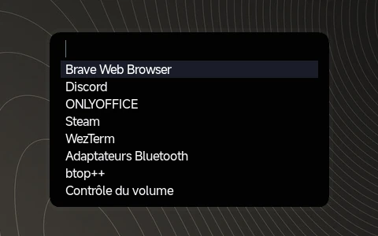

### `liseuse`

A reading library on `Super + F`. If a book is already open on the current workspace, it brings it back. Otherwise it opens a list to choose from. Press `F1` inside a book for the reading manual.

| | |
|---|---|
| Installs | zathura with the mupdf, cb and djvu plugins, mupdf; the Markdown renderer (python-markdown, Pygments, WeasyPrint, MathJax); `plantuml` |
| Links | `zathurarc`, `sources.conf`, and the `liseuse` launcher into `~/.local/bin` |
| Creates | `~/Livres`, and the file associations for documents |

**Formats**: PDF, EPUB, MOBI, AZW3, FB2, CBZ/CBR, DjVu, XPS, Markdown and PlantUML (`.puml`). Markdown is rendered the way GitHub does it, with syntax highlighting, maths (`$…$`, `$$…$$`), PlantUML blocks, and links between documents that work.

| To change | Edit |
|---|---|
| Folders to look in (besides `~/Livres`) | [`sources.conf`](../config/liseuse/sources.conf), one path per line |
| Reader keys and colours | [`zathurarc`](../config/liseuse/zathurarc) |
| How Markdown pages look | [`markdown.css`](../config/liseuse/markdown.css) |

In the list, the book you're currently reading comes first. Search looks at the full path as well as the title, so `md` or `dotfiles keybind` both work. Light and dark follow the desktop setting. `Space` and `Return` move forward, and `Shift` goes back: on slides they turn the page and fit the next one whole, in a book they scroll exactly one screen, so nothing is skipped. `F1` lists every key.

A book opens as a normal window. Use `Super + Shift + F` for fullscreen. While you're reading, notifications are silenced, and the screen stays on as long as a book is visible (see [Idle](#idle)).

Office documents can be converted to a PDF, saved next to the original:

```bash
liseuse convert [FILE…]    # with no argument, pick from the documents it found
```

This needs LibreOffice, which isn't installed with Liseuse (`libreoffice-writer libreoffice-impress libreoffice-calc`).

Rendered Markdown is cached in `~/.cache/liseuse/md/`.

### `plymouth`

*Optional.* The boot splash: the word **coucou** on black when the machine starts, **byebye** when it shuts down, with a thin progress bar and the boot log scrolling one line at a time underneath, in JetBrains Mono.

| | |
|:---:|:---:|
| 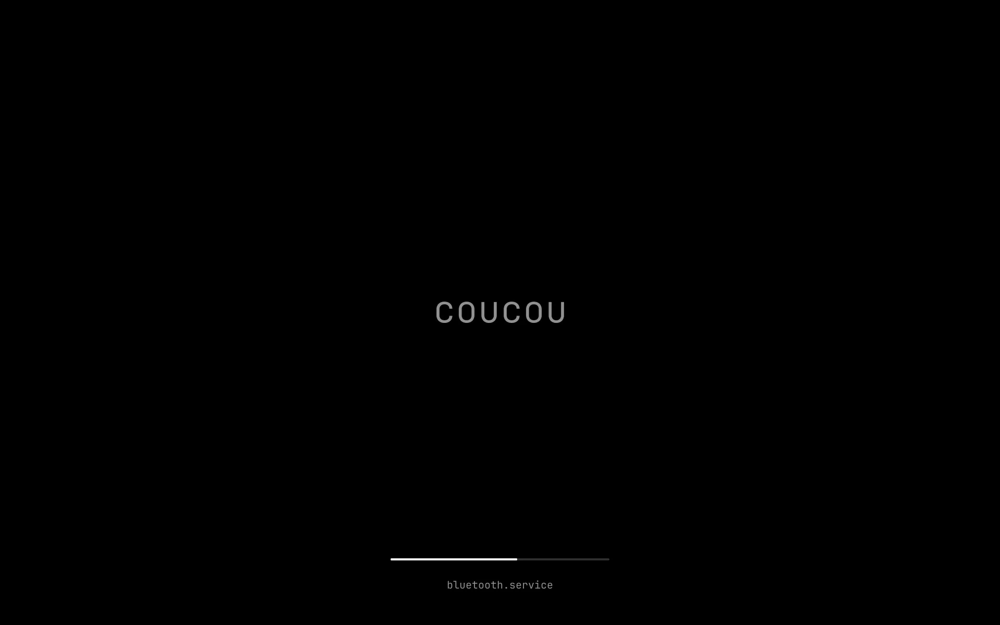<br>Boot | <br>Shutdown |

Installing it selects the theme and rebuilds the initramfs for every installed kernel. Each new kernel is checked as it comes in.

| Tool | Use |
|---|---|
| [`make-assets.py`](../config/boot/plymouth/make-assets.py) | Regenerates the images. Use `--width` if your screen isn't 1920 px wide |
| [`simulate.py`](../config/boot/plymouth/simulate.py) | Renders the animation to a video. Takes `--width/--height`, or `--heads 1920x1200,3840x2160` for several screens |
| [`preview.sh`](../config/boot/plymouth/preview.sh) | Shows the real splash on a spare console. Takes `--sweep`, `--password` and `--status`. It doesn't work on machines whose firmware framebuffer goes away after boot |

The layout and animation are in [`theme/coucou.script`](../config/boot/plymouth/theme/coucou.script). With several screens, the splash is sized for the smallest one.

If something goes wrong during a real boot, add `plymouth.debug` to the kernel command line and read `/var/log/plymouth-debug.log`.

### `greeter`

*Optional.* A login screen with greetd and tuigreet on the first console. It replaces any other display manager, and sets the console font to JetBrains Mono.

```bash
cc-pkg-mng install greeter
```

| Piece | What it is |
|---|---|
| [`greetd/`](../config/boot/login/greetd/) | The greetd configuration |
| [`console/`](../config/boot/login/console/) | The console font, generated by [`make-console-font.py`](../config/boot/login/make-console-font.py) (`--cell WxH`, `--preview`) |
| [`session-splash.sh`](../config/boot/login/session-splash.sh) | Keeps the word mark on screen until Hyprland has drawn its first frame |

---

## Applications

Each of these is just the application, nothing more. You can use any other app instead: install it, then make it the default for its role (see [default applications](#default-applications)).

### `wezterm`

The terminal. It comes in two builds:

| Variant | |
|---|---|
| `stable` (default) | The packaged build |
| `smear` | Built from source with a cursor smear effect (wezterm PR #7737), installed to `/usr/local/bin`. Neovim's own smear-cursor plugin turns itself off when it runs in this build |

```bash
cc-pkg-mng set wezterm variant smear
cc-pkg-mng install wezterm
```

### `firefox`

The default browser, with a system policy in `/etc/firefox/policies/`. The policy and the theme both apply at launch, so quit Firefox completely and relaunch it after installing.

The look comes from two stylesheets in the profile, [`userChrome.css`](../config/firefox/chrome/userChrome.css) for the browser and [`userContent.css`](../config/firefox/chrome/userContent.css) for the new-tab page. Both follow Firefox's **Website appearance** setting (Settings → General → Language and Appearance): Light, Dark or System. Dark is OLED black. The colours apply with Firefox's default, Light and Dark themes; pick any other theme (Settings → Extensions & Themes) and Firefox shows that theme instead. The new tab's ground is a faint 32 px grid that fades out towards the edges; a wallpaper or colour chosen with the pencil on the new tab replaces it.

**The tabs** run along the top or down the sidebar, Firefox's own switch: right-click the tabs and choose *Turn on vertical tabs* (or *Turn off*). Ctrl+Alt+Z opens or closes the sidebar.

**The new tab** (Ctrl+T) is Firefox's own page, rearranged: the Firefox logo in the middle with a frosted-glass search field under it, a dock at the bottom with the first six pinned shortcuts and a **+** to add one, and two lists on the right. **Favorites** holds the pinned shortcuts after the first six, **Frequent** the sites you visit most (six of each at most). Right-click a site to pin it, edit it or remove it; drag pinned shortcuts to change their order, and so which six sit in the dock. The pencil at the bottom right opens Firefox's own settings for the page. The policy pins GitHub, YouTube, ChatGPT, Gemini, Claude and Wikipedia on a new profile only, turns off sponsored sites, news stories and weather.

### `brave`

Installed from Brave's own repository. Not installed by default.

### `nemo`

The default file manager. It opens folders, answers to `org.freedesktop.FileManager1`, and shows thumbnails for files up to 32 MiB.

### `neovim`

The editor, on its own with no configuration. If you want mine, see [`config-nvim`](#config-nvim).

### `mpv`

The video and music player, installed by default and set to open video and audio files. It comes with [uosc](https://github.com/tomasklaen/uosc), a modern interface in the shell's colours, and [thumbfast](https://github.com/po5/thumbfast), which shows a thumbnail when you hover the timeline. The colours are in [`config/mpv/script-opts/uosc.conf`](../config/mpv/script-opts/uosc.conf). Playback settings are in [`config-extras`](#config-extras).

### `swayimg`

The image viewer, installed by default and set to open images. Its settings are in [`config/swayimg/init.lua`](../config/swayimg/init.lua).

| Key | Does |
|---|---|
| `←` `→` | Previous or next image in the folder |
| `Return` | Gallery, and back |
| `e` | Edit in satty (crop, arrows, text, blur), saved as `name-edit.png` next to the original |
| `f`, `[` `]` | Fullscreen, rotate |
| `q`, `Esc` | Quit |

### `games`

Steam (from RPM Fusion) and Lutris, both opened from the [controller menu](#manette). Not installed by default.

### `mangohud` · `fastfetch`

The gaming overlay along with GOverlay, and the system summary tool. Their settings are in [`config-extras`](#config-extras).

### `ccnote` · `ccslide`

Two small terminal tools: one for quick notes, the other for Markdown slides through `mdp` (built from source, because Fedora doesn't package it). Not installed by default.

---

## Configurations

My personal setups. `init` asks whether you want each one. If you adopt one, every file it would replace is moved to the backups first, and `cc-pkg-mng remove` puts them back.

### `config-shell`

zsh and bash with my prompt and aliases, plus zoxide, fzf, ripgrep, fd and tmux. It makes zsh your login shell, with zsh-autosuggestions and zsh-syntax-highlighting.

| To change | Edit |
|---|---|
| Aliases | [`config/bash/.bash_aliases`](../config/bash/.bash_aliases) |
| Prompt | [`config/bash/prompt.zsh`](../config/bash/prompt.zsh) |
| tmux | [`config/tmux/.tmux.conf`](../config/tmux/.tmux.conf) |

### `config-wezterm`

My WezTerm setup: [`config/wezterm/wezterm.lua`](../config/wezterm/wezterm.lua).

### `config-nvim`

My Neovim setup: `init.lua`, `lua/`, `ftplugin/`, `colors/` and `bin/`, linked into `~/.config/nvim/`. Folders are linked as a whole, so a new file under `config/nvim/lua/` works straight away.

| Feature | How to use it |
|---|---|
| Live Markdown preview | `Alt + P` opens a GTK 4 window that updates block by block, maths included |
| PlantUML | Highlighting, linting, completion, and a live preview window. `:PumlFromJava` draws a class diagram from Java sources, and `:PumlExport` exports it |

The optional tools are just that: without `plantuml-lsp` you lose PlantUML completion, and without MathJax the preview shows maths as raw TeX. Everything else keeps working.

### `config-extras`

Settings for mpv, MangoHud, fastfetch and Brave, each one only if that app is installed: `~/.config/mpv/mpv.conf`, `~/.config/MangoHud/MangoHud.conf`, `~/.config/fastfetch/config.jsonc`, and Brave's flags from [`config/brave/brave-flags.conf`](../config/brave/brave-flags.conf).
